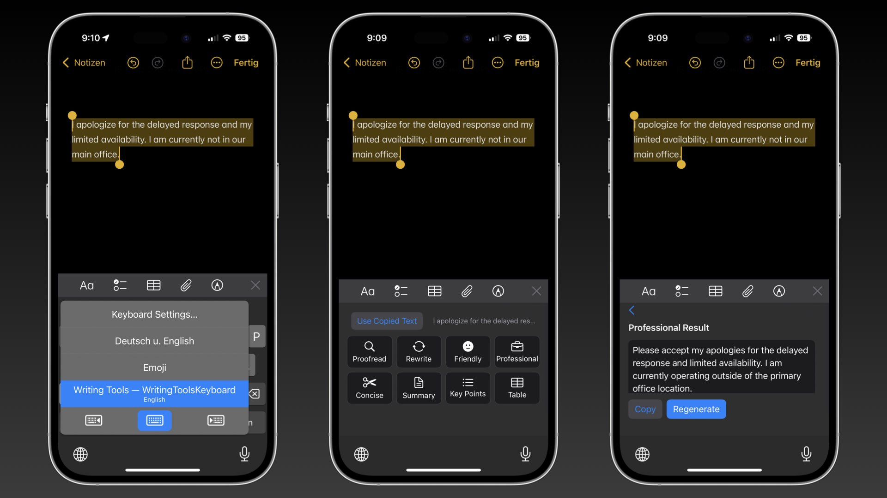
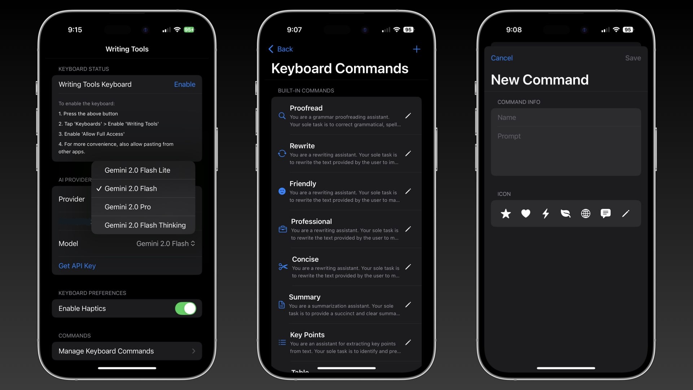

# WritingTools Keyboard

## TestFlight Beta

## Overview

**Writing Tools Keyboard** is an iOS third-party keyboard designed to help users improve their writing on the go. Whether you need to proofread a sentence, rewrite text for clarity, generate summaries, or even convert text into a table, this keyboard provides quick AI-assisted features at your fingertips. It supports Custom Instructions that you can define in the app and use in the keyboard. You can choose from multiple writing options, and the tool will either correct, refine, or transform your text using various AI models. AI Providers: Gemini, Mistral, and OpenAI API.

The Windows/Linux versions are developed by Jesai Tarun (@theJayTea). The macOS version is developed by me. 

  
*Keyboard Flow with the tools*

### Keyboard Features

- Real-time text transformations:
  - Proofreading & grammar checks
  - Style adjustments (professional/friendly/concise)
  - Summarization & table generation
- Cloud AI providers:
  - Google Gemini
  - OpenAI GPT
  - Mistral API
- Custom command system for adding your own commands to use in the keyboard!
- Clipboard integration

  
*You can use the app to select AI Provider, define custom commands or edit current ones.*

## Future Plans

- Make the keyboard more stable
- Add Landscape Support
- Add iPad Support
- Other Languages

## Credits
- As previously said this project wouldn't be possible without the original WritingTools Project by Jesai Tarun @theJayTea. (https://github.com/theJayTea/WritingTools)
- Suggestions and ideas of @Joaov41 made this project much better and more functional. Specifically they helped me with adding automatic text detection (under 200 characters) to the app. 
