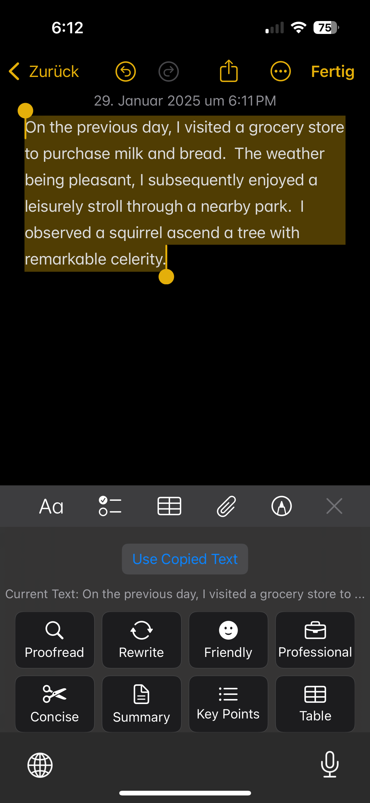
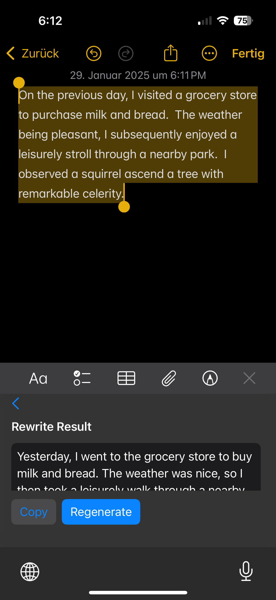
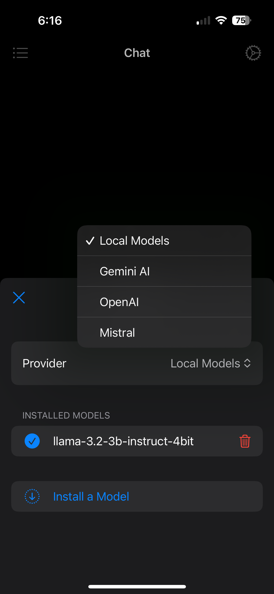
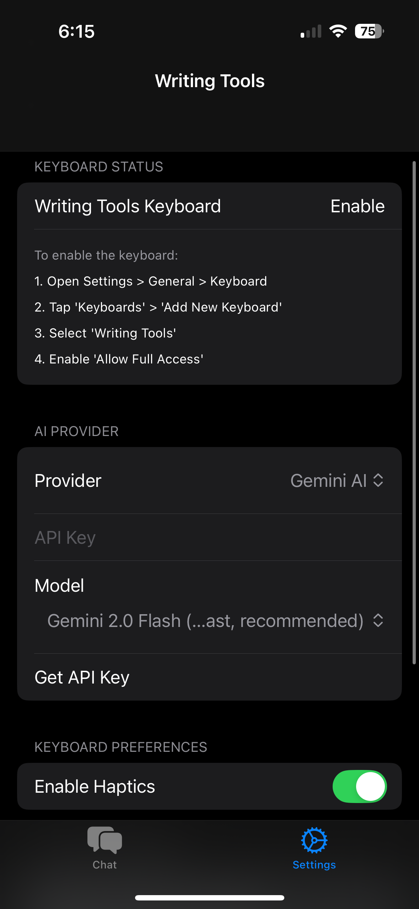
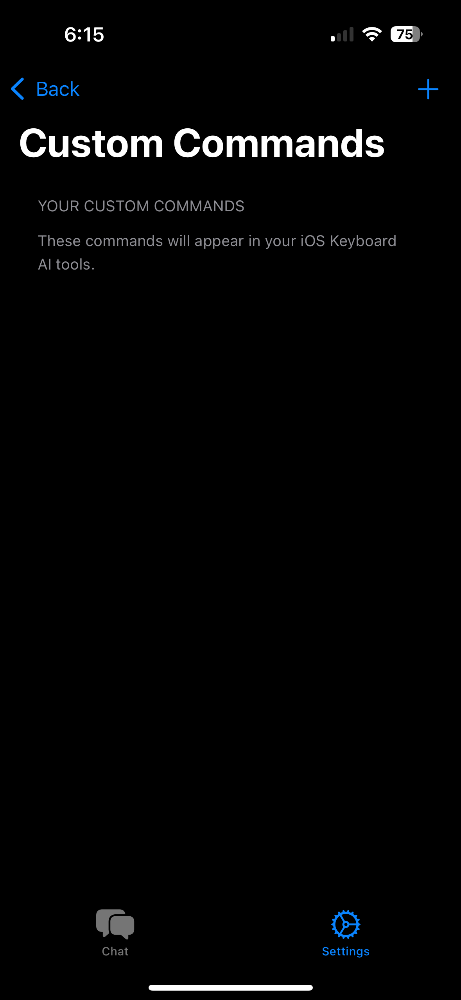

# WritingTools Keyboard

#### Description: A dual-component system featuring:
1. **Main App**: Chat interface with local LLM support (MLX models) and cloud Providers
2. **Keyboard Extension**: AI writing tools using cloud providers (Gemini/OpenAI/Mistral)

  
*Main Keyboard interface with the tools*

## Overview

**Writing Tools Keyboard** is an iOS third-party keyboard designed to help users improve their writing on the go. Whether you need to proofread a sentence, rewrite text for clarity, generate summaries, or even convert text into a table, this keyboard provides quick AI-assisted features at your fingertips. It supports Custom Instructions that you can define in the app and use in the keyboard. You can choose from multiple writing options, and the tool will either correct, refine, or transform your text using various AI models. It supports Gemini, Mistral, and OpenAI APIs for the keyboard extension. The app itself supports Chatting with all of these AI Models, but also allows you to download some local LLMs (Phi3.5 Mini, Llama3.2 3b and Llama3.2 1b) and chat completely offline and on device with them.

The Windows/Linux versions are developed by Jesai Tarun (@theJayTea). The macOS version is developed by me. 

*The rewrite tool in action*

### Main App Features (Chat Tab)
  
*Chat interface with local LLM integration*

- Local LLM conversations using MLX models
- Model management (install/remove 4-bit quantized models)
- Threaded conversation history
- Cloud AI Providers can also be used via API

### Keyboard Features
  
*Writing Tools keyboard with AI button*

- Real-time text transformations:
  - Proofreading & grammar checks
  - Style adjustments (professional/friendly/concise)
  - Summarization & table generation
- Cloud AI providers:
  - Google Gemini
  - OpenAI GPT
  - Mistral API
- Custom command system
- Clipboard integration

  
*You can add your own custom commands to use in the keyboard!*

## Project Structure and File Descriptions (Outdated, will be updated soon)

1. **App (Main iOS App)**  
   - **`WritingToolsApp.swift`**: Entry point of the main SwiftUI app. It initializes the settings interface where the user can configure API keys, enable or disable features like autocorrect, and manage the keyboard status.  
   - **`SettingsView.swift`**: A SwiftUI view presenting toggles and pickers for customizing the keyboard’s behavior (e.g., enabling number row, suggestions, haptics). It also includes directions for enabling full access on iOS.

2. **Keyboard Extension**  
   - **`KeyboardViewController.swift`**: The main controller for the iOS keyboard extension. It hosts the SwiftUI keyboard view (`KeyboardView`) and adds a translucent blur to achieve a modern iOS look. It also handles basic events such as inserting text, deleting backward, and returning new lines.  
   - **`AIToolsView.swift`**: A SwiftUI subview that displays the AI options (Proofread, Rewrite, Friendly, etc.) and triggers requests to the chosen AI provider. It shows a loading spinner while requests are processed and displays the resulting text in a scrollable box.  
   - **`AIOptionButton.swift`**: A small SwiftUI component representing each AI tool option. Displays the tool’s icon and name, and runs the appropriate callback when tapped.  
   - **`KeyButton.swift`**: A custom SwiftUI button style for individual keys (letters, numbers, SHIFT, etc.). It includes haptic feedback support and manages visual states (pressed vs. unpressed).  
   - **`KeyboardManager.swift`**: Responsible for generating autocomplete suggestions and performing basic autocorrect logic using `UITextChecker`.

3. **Shared Models and Utilities**  
   - **`AppState.swift`**: A shared singleton storing the active AI provider (OpenAI or Gemini) and user-configurable settings. It also loads and saves API keys and user preferences to `UserDefaults`.  
   - **`AIProvider.swift`**: Defines the protocol for any AI provider object, ensuring consistency in the methods used for processing text and canceling requests.  
   - **`OpenAIProvider.swift`** and **`GeminiProvider.swift`**: Concrete classes implementing `AIProvider`. They handle all network requests to their respective APIs. Both providers use prompt truncation for very long texts to reduce memory usage and potential errors.  
   - **`Error.swift`**: Defines a custom error type (`AIError`) to capture network, server, and user-input errors.
   - **`KeyboardConstants.swift`**: Stores button spacing, corner radius, color names, and haptic settings, ensuring a consistent look and feel across the keyboard.

## Design Decisions

- **SwiftUI and UIKit Integration**: One main consideration was whether to build the keyboard UI purely in UIKit or utilize SwiftUI. I chose SwiftUI for easier layout management, declarative syntax, and quicker iteration. UIKit remains necessary for bridging certain keyboard extension specifics.  
- **User Preferences via `UserDefaults`**: To store toggles like “Show Number Row” or “Enable Suggestions,” I used `AppStorage` and an app group. This ensures both the settings app and the keyboard extension share the same data.  
- **AI Tools UI**: To improve user experience, I integrated all AI tools into a single interface, allowing seamless switching between standard keyboard functions and AI features.
- **Prompt Truncation**: Large prompts can overload memory or exceed API length limits. I decided on truncating inputs to 8,000 characters as a safeguard, balancing thoroughness with performance.  
- **Translucent Background**: For a modern iOS feel, I used `UIVisualEffectView` with `.systemUltraThinMaterial`. Early versions used a solid gray background, but the translucent blur matches typical iOS keyboards more closely.

## Future Plans

- Text Suggestions
- Make the keyboard more stable
- Add Landscape Support
- Add iPad Support
- Other Languages
- Better App Chat Interface

## Credits
- For Local Models, MLX-Swift and MLX-Swift Examples were used. (https://github.com/ml-explore/mlx-swift)
- Some parts of the Chat Interface and Download Interface were inspired by fullmoon iOS app. (https://github.com/mainframecomputer/fullmoon-ios)
- As previously said this project wouldn't be possible without the original WritingTools Project by Jesai Tarun. (https://github.com/theJayTea/WritingTools)
